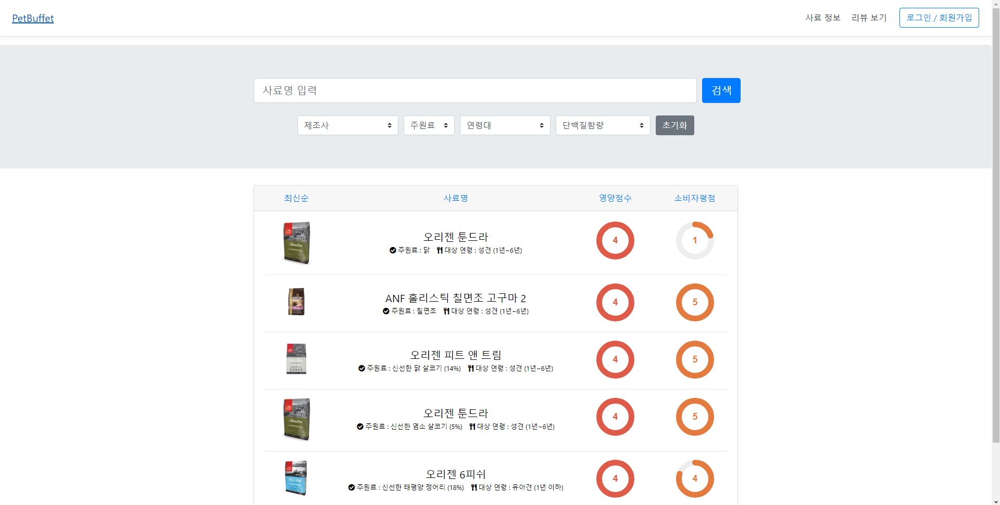

[petbuffet]: http://10.105.185.181

# PetBuffet

  

PetBuffet은 시중에 나와있는 강아지 사료들의 성분 및 영양정보를 분석해주는 웹서비스입니다. 
각 사료들에 대한 리뷰 기능을 탑재해 사료에 대한 사람들의 평가 또한 확인 가능한 점이 특징입니다.

## 간략한 기능 소개 ( <a href="https://oss.navercorp.com/nbp-internship-2018-team3/kyunggeun.lee/wiki/Feature-list">Feature list 보러가기</a> )
* 사료정보, 리뷰, 댓글 CRUD
* 사료정보, 리뷰 검색
* 로그인 / 로그아웃 / 회원가입
* 리뷰 추천 / 비추천
* 사료 이미지 업로드
* 네이버 쇼핑, 최저가 정보
* 사료에 대한 평점 주기
* 사료 검색 자동완성

## 기술 스택
* Express.js (WAS, 포트 80)
* Nginx (파일 서버, 포트 8080)
* MySQL (DBMS)
* jQuery

## 기획서
<a href="https://oss.navercorp.com/nbp-internship-2018-team3/kyunggeun.lee/wiki/PetBuffet-%EA%B8%B0%ED%9A%8D%EC%84%9C">기획서 보기</a>

## DB Schema
<a href="https://oss.navercorp.com/nbp-internship-2018-team3/kyunggeun.lee/wiki/ER-Diagram">ERD 보기</a>

## 프로젝트 설치 및 실행
### git clone, npm install
    git clone https://oss.navercorp.com/nbp-internship-2018-team3/kyunggeun.lee.git
    cd kyunggeun.lee
    npm install

### 프로젝트 실행
    NODE_ENV=production node app.js

### 배포된 서버 정보 (테스트 아이디 / PW : aaaaa / aaaaa)
    10.105.185.181
